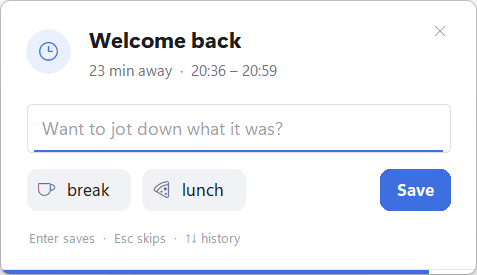

# aw-toolkit

Small, dependency-free add-ons that turn [ActivityWatch](https://activitywatch.net) on Windows from
"how long was which window open" into **"what did I actually work on, and what came out of it"**.

| Component | What it adds to ActivityWatch | Bucket |
|---|---|---|
| [aw-watcher-away](watchers/aw-watcher-away) | When you come back after being away (idle, locked screen, sleep), a small popup asks what you were doing. Lab, meetings and teaching stop showing up as "nothing". | `aw-watcher-away_<host>` |
| [aw-watcher-output](watchers/aw-watcher-output) | Saved files and git commits of the project you are working on right now, found from the active window. | `aw-watcher-output_<host>` |
| [Claude Code hook](claude-code) | One event per Claude Code turn: session name, what you asked, working folder. | `aw-watcher-claude_<host>` |
| [MCP server notes](docs/mcp-server.md) | Let Claude query and summarise your ActivityWatch data. | – |

Everything stays on your machine and only talks to the local ActivityWatch server (`localhost:5600`).
Pure Python standard library, no `pip install`.

<p align="center"></p>

## Requirements

- Windows 10/11 (the watchers use Win32 APIs; the popup is styled for Windows 11)
- [ActivityWatch](https://activitywatch.net/downloads/) 0.13+ running
- Python 3.11+ on `PATH` (python.org or Microsoft Store both work)
- optional: [Claude Code](https://claude.com/claude-code) for the hook

## Install

```powershell
git clone https://github.com/lysek01/aw-toolkit.git
cd aw-toolkit
powershell -ExecutionPolicy Bypass -File .\install.ps1
```

`install.ps1` puts both watchers into your Startup folder (started via `pythonw`, no console window),
starts them, registers the Claude Code hook if `~/.claude` exists, and enables `aw-watcher-input`
in `aw-qt.toml` unless you already manage `autostart_modules` yourself.
Skip parts with `-NoAway`, `-NoOutput`, `-NoClaudeHook`, `-NoAwQt`.
Run it again after `git pull` to update; `uninstall.ps1` reverts everything except your data.

In the ActivityWatch web UI the new buckets appear as their own rows in **Timeline**.
The *Activity* view only knows window/web/AFK buckets, so it won't show them - use the
[MCP server](docs/mcp-server.md) or the API to analyse them.

## aw-watcher-away

Asks after **10+ minutes** away - no input, locked screen (exact lock time) or sleep. Type anything
("lab measurements", "meeting") or click a quick button (*break*, *lunch*). Enter saves, Esc skips,
Up/Down browse earlier answers. Left untouched, it closes after 2 minutes and records `timeout`.
The countdown pauses while there is text in the field.

```jsonc
// event data
{"message": "lab measurements", "status": "answered", "reason": "locked"}
// status: answered | skipped | timeout      reason: idle | locked | sleep
```

Try the popup without waiting: `python watchers\aw-watcher-away\aw_watcher_away.py --test`
(writes to a separate `-test` bucket). Settings: [config.example.toml](watchers/aw-watcher-away/config.example.toml)
- language (auto/en/cs), threshold, auto-close, quick buttons.

The popup takes keyboard focus when it appears so you can type right away.

## aw-watcher-output

Instead of watching the whole disk it follows your focus. Every 30 s it asks ActivityWatch for the active
window and maps it to a folder:

| Window | Source of the full path |
|---|---|
| KiCad (project manager, schematic, PCB) | `%APPDATA%\kicad\<ver>\kicad.json` file history |
| Arduino IDE 2 | `~\.arduinoIDE\recent-sketches.json` |
| VS Code (with a folder open) | `%APPDATA%\Code\User\globalStorage\storage.json` |
| Word, Excel, PDF viewers, … | Windows *Recent items* (`.lnk` targets, incl. network shares) |

The folder is widened to the project root (nearest git repo, else a folder with `*.kicad_pro`,
`platformio.ini`, `package.json`, …). Only these folders are watched - at most 6, dropped after
2 h without activity - using `ReadDirectoryChangesW`, so the process sleeps until Windows reports a change.
Network shares work too; if a share doesn't support notifications the folder is rescanned every 2 minutes.
Commits are read from `.git/logs/HEAD`, git is never executed. Backups, lock files, `.git`, `node_modules`,
build output and similar noise are ignored.

Every 5 minutes one event per project:

```json
{"title": "LoRa-169: 12 saves · 1 commits", "project": "LoRa-169", "root": "C:\\...\\LoRa-169",
 "saves": 12, "files": ["hardware/169_gateway/169_gateway.kicad_sch"],
 "commits": [{"hash": "3f2a9c1b0d", "msg": "fix antenna match"}]}
```

Measured cost: ~0 % CPU, ~37 MB RAM (the Python runtime itself).

`python watchers\aw-watcher-output\aw_watcher_output.py --once` shows which project the current window maps to.
Windows that could not be mapped are counted in `data\unmatched.json` - a good hint for which source
to add next. Settings: [config.example.toml](watchers/aw-watcher-output/config.example.toml).

**Not covered yet:** files opened in VS Code without a folder, documents that live directly in
Downloads/Desktop/Documents (those are never treated as a project), apps that neither keep a recent-files
list nor show the path in their title.

## Claude Code hook

`UserPromptSubmit` remembers the start and your prompt, `Stop` writes the event:

```json
{"app": "Claude", "title": "Monitoring productivity at work", "prompt": "add a --once flag",
 "first_prompt": "I'd like to track my work…", "cwd": "C:\\Users\\me\\project", "session_id": "…"}
```

`title` is the session name from the Claude Code app sidebar. Harness messages (`<task-notification>` …)
are not stored as prompts. The hook never prints, always exits 0 and gives up after 0.5 s if ActivityWatch
isn't running, so it can't slow down or break Claude Code. Manual setup:
[settings.example.json](claude-code/settings.example.json), or `python claude-code\hook_setup.py install`.

## Data & privacy

All data goes to your local ActivityWatch only. Each watcher keeps small helper files in its own `data\`
folder (answer history, events queued while ActivityWatch was down, a log) - ignored by git.
The output watcher stores file paths and commit messages; the Claude hook stores the first line of your
prompts. Keep that in mind before syncing or exporting your ActivityWatch database.

## Tests

```powershell
cd tests
python -m unittest -v
```

## Good to know

[docs/windows-gotchas.md](docs/windows-gotchas.md) collects the non-obvious problems hit while building
this - `aw-notify` crashing on Windows, Microsoft Store Python redirecting `AppData`, non-ASCII hook input,
DPI scaling in Tkinter, and more.

## License

[MIT](LICENSE)
